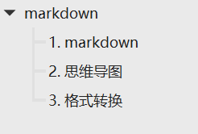

[TOC]
# markdown

## 1. markdown
 
- 记录使用为知笔记
- 编辑时使用外置typora：安装typora后，为知笔记设置编辑器
  > 本地图片可能会有问题，添加附件备份

- 第三方编辑器编辑图片失效解决
  > 第三方编辑器保存md文件，图片引用使用相对路径，图片和md在同一目录，为知新建普通笔记，将md文件渲染的内容全选复制过来，md和图片文件作为附件。以后修改直接修改附件的md文件，修改完成再重新复制内容
 
 
## 2. 思维导图
- 在线制作：zhimap
  > 微信登录
 
 
- 本地：xmind
- markdown转思维导图：typora导出doc或opml，xmind导入
 
 
## 3. 格式转换
 
- 安装pandoc
- 重启电脑后typora可以使用

  